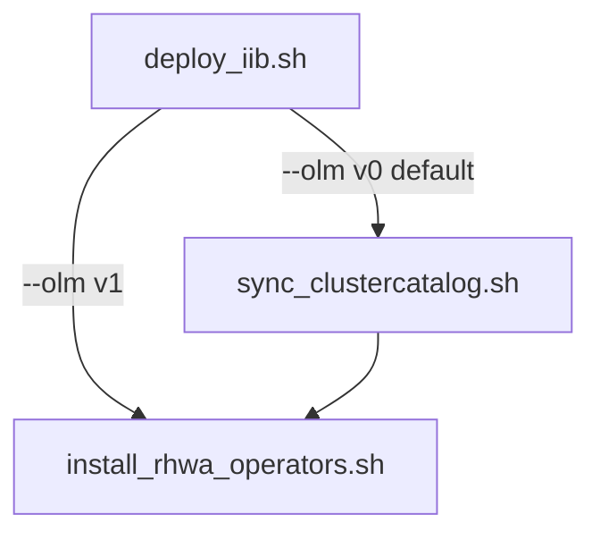

## RHWA cluster setup workflow

End-to-end order for deploying RHWA operators from internal IIB or Konflux catalogs on a test cluster.

### Pipeline overview



| Step | Script | When to use |
|------|--------|-------------|
| 1 | `helper_scripts/deploy_iib.sh` | Deploy a brew/IIB catalog. Use `--olm v0` (default) for CatalogSource or `--olm v1` for ClusterCatalog directly. Skip if the catalog already exists. |
| 2 | `helper_scripts/sync_clustercatalog_from_catalogsource.sh` | **Only with `--olm v0`** on OLM v1 clusters: align `ClusterCatalog` with the CatalogSource. Skip when using `--olm v1` (deploy_iib creates ClusterCatalog directly) or on classic OLM-only clusters. |
| 3 | `helper_scripts/install_rhwa_operators.sh` | Install all five RHWA operators via Subscriptions. Use `--create-idms` when testing disconnected/Konflux mirrors. |

Shared helpers live in `helper_scripts/lib/rhwa_utils.sh` (catalog wait, pull-secret merge, ClusterCatalog Serving wait).

**IDMS note:** IDMS is only needed when installing operators from unverified/brew catalogs (IIB). The default `redhat-operators` catalog does not require IDMS.

### Example: OLM v1 cluster with brew catalog (recommended)

```bash
# 1. Deploy IIB as ClusterCatalog directly (no sync step needed)
./helper_scripts/deploy_iib.sh 1141449 --olm v1 --convert-secret

# 2. Install operators
./helper_scripts/install_rhwa_operators.sh \
  --catsrc rhwa-iib-1141449 \
  --catsrc-ns openshift-operators \
  --create-idms
```

### Example: OLM v0 cluster with brew catalog (classic)

```bash
# 1. Deploy IIB catalog as CatalogSource
./helper_scripts/deploy_iib.sh 1141449 --convert-secret

# 2. Sync OLM v1 ClusterCatalog (only if cluster also runs operator-controller)
./helper_scripts/sync_clustercatalog_from_catalogsource.sh \
  --CATSRC_NAME=rhwa-iib-1141449 \
  --CLUSTERCATALOG_NAME=rhwa-iib-1141449-cluster-catalog

# 3. Install operators (add --create-idms for Konflux mirror mapping)
./helper_scripts/install_rhwa_operators.sh \
  --catsrc rhwa-iib-1141449 \
  --catsrc-ns openshift-operators \
  --create-idms
```

### Example: connected cluster with redhat-operators

```bash
./helper_scripts/install_rhwa_operators.sh
```

No IIB deploy or ClusterCatalog sync needed when using the default `redhat-operators` catalog on classic OLM.

### Per-script documentation

- [install_rhwa_operators.sh](helper_scripts/install_rhwa_operator.md)
- [sync_clustercatalog_from_catalogsource.sh](helper_scripts/sync_clustercatalog_from_catalogsource.md)

### Troubleshooting

- **CSV stuck Pending / ResolutionFailed after re-run:** orphaned CSVs from a prior install — `oc delete csv --all -n openshift-workload-availability`, then re-run install.
- **ClusterCatalog not Serving:** ensure brew pull secrets were merged into the global pull-secret (automatic with `--olm v1`; use `--SYNC_PULL_SECRETS` with the sync script for v0).
- **IDMS generation fails on multi-catalog cluster:** install `opm` on the machine running the install script.
